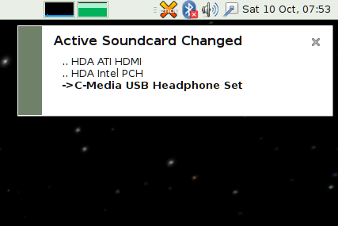

# perl-audio-switcher

A small perl script to cycle through you audio outputs.

Use you favourite tool to bind a keyboard short-cut to pas.pl... 
(Remember to make pas.pl executable using **chmod u+x pas.pl**)

Depends on: perl, notify-send and pactl

Which you may install if not already installed using: 
**sudo apt install perl libnotify-bin pulseaudio-utils**

Open pas.pl in you favourite text editor to customise 
**$delay**, the delay time the notification stays on the screen 
**%vetoCardNames**, lists (unconnected) cards you don't want to switch to

**showvol.pl** a simple companion script for showing the current volume.  
Additionally depends on: **sudo apt install pulsemixer**